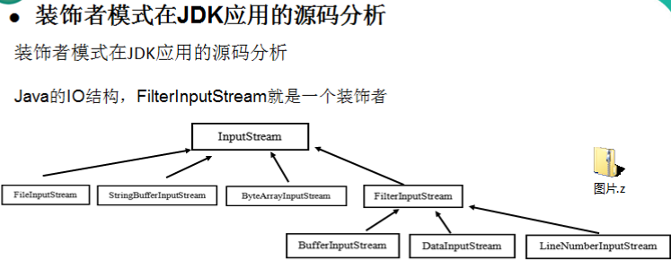
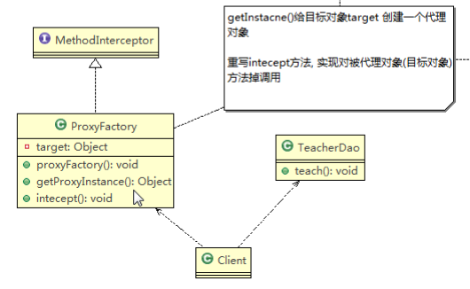

# Design Pattern


## 创建型模式

### **单例模式**

> 单例模式保证了系统内存中只会 存在一个对象，节省了系统资源，对于一些需求频繁创建和销毁的对象，使用单例模式可以提高系统的性能。
>
> **使用场景**：需要频繁的创建和销毁对象，创建对象耗时过长或者耗费资源过多（指重量级的对象），但又经常用到的对象，工具类对象，频繁访问数据库或文件的对象（比如数据源、session工厂等）
>
> 源码参考：java.lang.Runtime 就是经典的饿汉式（静态变量）的单例模式

1.  **饿汉式（静态常量）**

   > 步骤如下
   >
   > 1. 构造器私有化（防止通过new创建出新的对象）
   > 2. 类的内部创建
   > 3. 向外暴露一个公共的方法，e.g    getInstance 

   

   ```java
   public class SingletonPattern01 {
       private final static SingletonPattern01 singleInstance = new SingletonPattern01();
   
       //构造器私有化，外部不能new对象
       private SingletonPattern01() {
       }
   
       public static SingletonPattern01 getInstance(){
           return singleInstance;
       }
   }
   ```

   

2. **饿汉式（静态代码块）**

   > 步骤和‘静态常量’的一样
   >
   > 区别在于要创建一个静态块用于实例化对象

   

   ```java
   public class SingletonPattern02 {
       private static SingletonPattern02 singleInstance;
   
       //静态代码块，创建单个对象
       static{
           singleInstance = new SingletonPattern02();
       }
   
       //构造器私有化，外部不能new对象
       private SingletonPattern02() {
       }
   
       public static SingletonPattern02 getInstance(){
           return singleInstance;
       }
   
   }
   ```

   

3. 懒汉式（线程不安全）

   > 步骤区别在于创建是在getInstance 里面创建的，按需创建

   

   ```java
   public class SingletonPattern03 {
       private static SingletonPattern03 instance;
   
       //构造器私有化，外部不能new对象
       private SingletonPattern03() {
       }
   
       //当去调用getInstance的时候才进行实例化
       public static SingletonPattern03 getInstance(){
           if (instance == null){
               instance = new SingletonPattern03();
           }
           return instance;
       }
   }
   ```

   

4. 懒汉式（线程安全，同步方法）

   > 在获取实例的方法上加同步。

   

   ```java
   public class SingletonPattern04 {
       private static SingletonPattern04 instance;
   
       //构造器私有化，外部不能new对象
       private SingletonPattern04() {
       }
   
       //当去调用getInstance的时候才进行实例化
       public static synchronized SingletonPattern04 getInstance(){
           if (instance == null){
               instance = new SingletonPattern04();
           }
           return instance;
       }
   }
   ```

   

5. 懒汉式（线程安全，同步代码块）

   > 在需要创建实例的代码上使用同步

   

   ```java
   public class SingletonPattern05 {
       private static SingletonPattern05 instance;
   
       //构造器私有化，外部不能new对象
       private SingletonPattern05() {
       }
   
       //当去调用getInstance的时候才进行实例化
       public static  SingletonPattern05 getInstance(){
           if (instance == null){
               synchronized(SingletonPattern05.class){
                   instance = new SingletonPattern05();
               }
           }
           return instance;
       }
   }
   ```

   

6. **双重检查**

> 将变量用volatile修饰，确保可见性
>
> 在同步代码块中增加一个静态变量的判断。

```java
public class SingletonPattern06 {
    //volatile保证了多线程情况下的静态变量可见性。
    private static volatile SingletonPattern06 instance;

    //构造器私有化，外部不能new对象
    private SingletonPattern06() {
    }

    //当去调用getInstance的时候才进行实例化
    public static SingletonPattern06 getInstance(){
        if (instance == null){
            synchronized(SingletonPattern06.class){
                if (instance == null){
                    instance = new SingletonPattern06();
                }
            }
        }
        return instance;
    }
}
```

7. **静态内部类**

   > 创建实例在静态内部类中创建
   >
   > 静态内部类的特点：
   >
   > - 不会随着它的外层类去加载而被加载，而是在调用静态内部类方法的时候去加载内部类
   > - 采用了类加载机制保证了创建实例的时候只有一个线程

   

   ```java
   public class SingletonPattern07 {
   
       //构造器私有化，外部不能new对象
       private SingletonPattern07() {
       }
   
       private static class SingletonInstance{
           private static final SingletonPattern07 INSTANCE =new SingletonPattern07();
       }
   
       //当去调用getInstance的时候才进行实例化
       public static SingletonPattern07 getInstance(){
           return SingletonInstance.INSTANCE;
       }
   }
   ```

   

8. **枚举**

   > 在枚举里创建的实例都是单例的。
   >
   > 不仅能避免线程同步的问题，还能通过这种方式防止反序列化创建新的对象，所以推荐使用

   

   ```java
   public enum SingletonPattern08 {
       INSTANCE;
       public void say(){
           System.out.println("ok!");
       }
   }
   ```

   

### 简单工厂模式（静态工厂模式）

> 简单工厂是由一个工厂对象决定创建出哪一种产品的实例，简单工厂模式是最工厂模式中最简单实用的模式
>
> 定义了一个创建对象的类，由这个类来封装实例化对象的行为。
>
> **使用场景：**在软件开发中，当我们会用到大量的创建某种、某类或者某批对象时，就会用到工厂模式。
>
> 源码参考 java.util.Calendar


> 相关代码见包 com.lga.pattern.factory 下的代码

### 工厂方法模式


> 定义一个创建对象的抽象方法，由子类去决定需要实例化的类。工厂方法模式将对象的实例化推迟到了子类

### 抽象工厂模式


> - 定义一个interface用于创建相关或者有依赖关系的对象簇，而无需指明具体的类
> - 抽象工厂可以将**简单工厂**和**工厂方法**进行整合
> - 从设计层面看，抽象工厂就是对简单工厂模式的改进（进一步的抽象）
> - 将工厂抽象成两层，AbsFactory（抽象工厂）和具体实现的工厂子类。程序员可以根据创建对象类型使用对应的工厂子类，这样将单个工厂变成了工厂簇，更利于代码的维护和扩展

### 原型模式

> 对象的克隆。
>
> 浅拷贝（基本数据类型拷贝，但是引用数据类型拷贝的是引用对象地址），深拷贝（基本数据类型和引用数据类型都是拷贝数据值）
>
> - 实现Cloneable接口，重写clone方法
> - 序列化实现克隆
>
> 代码参考：spring中的bean的获取，getBean源码，可以设置scope.默认是singleton单例。可以设置为prototype

```java
//序列化实现深拷贝
public static Object deepClone(Object targetObj) throws IOException, ClassNotFoundException {
        Object object = null;
        //创建流对象，将tragetObj以流的形式输出
        ByteArrayOutputStream bos = new ByteArrayOutputStream();
        new ObjectOutputStream(bos).writeObject(targetObj);
        //反序列化,将对象输入进来
        object = new ObjectInputStream(new ByteArrayInputStream(bos.toByteArray())).readObject();
        return object;
    }
```


### 建造者模式

## 结构型模式

### 适配器模式

> 目的：做到兼容

1. 类适配器模式

   

   基本介绍：Apater类，通过集成src，实现dst类接口，完成src->dst的传递

2. 对象适配器模式

   

   和类的适配器模式相同，只是将Adapter类做修改，不是集成src类，而是持有src的实例，以解决兼容性问题。即：持有src类，实现dst类接口

3. 接口适配器模式

    当不需要全部实现接口提供的方法时，可先设计一个抽象类实现接口，并为该接口中每个方法提供一个默认实现（空方法实现），那么该抽象类的子类（匿名内部类）可以有选择的实现一个方法来完成对应的需求。

   
   
   ​	SpringMVC中的handlerAdater
   
   


### 桥接模式


jdbc源码分析


### **装饰者模式**

> 动态的将新功能附加到对象上。在对象功能扩展方面，它比继承更具有弹性，装饰者模式也体现了开闭原则。
>
> 源码分析：FilterInputStream就是一个装饰者




### 组合模式

> 源码hashMap


****


### 外观模式


### 享元模式

> 源码分析Integer中的valueOf方法


  


### **代理模式** 


 


 

 

## 行为型模式

### 模板方法模式

> 源码分析spring IOC


  


### 命令模式

### 访问者模式


### 迭代器模式


**观察者模式**

中介者模式

备忘录模式

解释器模式（Interpreter模式）

状态模式

策略模式

职责链模式（责任链模式）